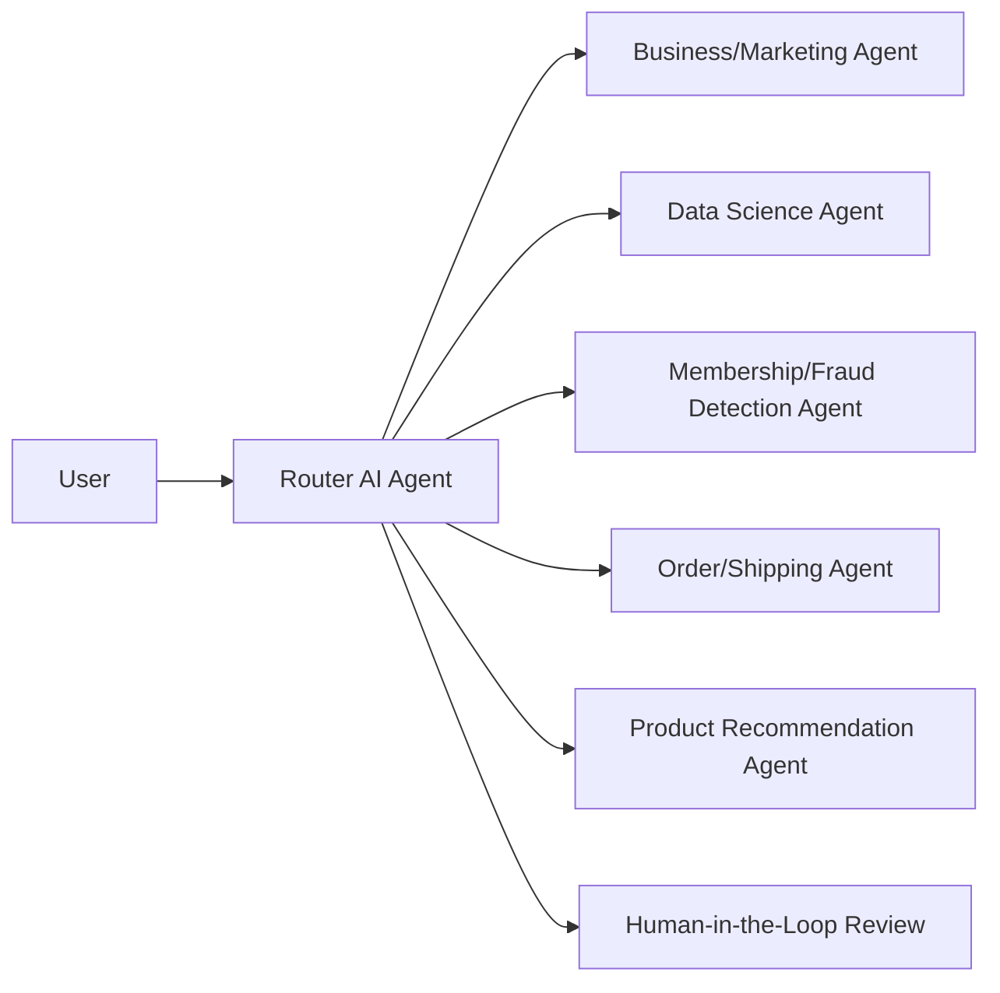

# Peloton AI Agent Ecosystem — Project Phase 1

This repository contains the requirements analysis, user stories, implementation planning, and synthetic training/testing data for an AI agent–powered automation ecosystem for Peloton.

**Course:** Northwestern University MSDS 442  
**Student:** Haochen Lian  
**Phase:** Final Project — Phase 1 (Requirements Analysis)

## Project Objective

The proposed system uses a Router AI Agent to classify user requests and direct them to one of five specialized agents:



The design emphasizes safe automation. Routine, low-risk requests can be handled automatically, while sensitive, ambiguous, financial, privacy-related, or irreversible actions require human review.

## Assignment Requirements

### Requirement 1 — Automation Feasibility

Analyze whether the listed responsibilities, workflows, features, and functionality can be fully automated with multimodal LLM-based AI agents. The report identifies where human oversight is still necessary.

### Requirement 2 — User Stories

Define three specific and implementable user stories for each specialized agent:

- Business/Marketing
- Data Science
- Membership/Fraud Detection
- Order/Shipping
- Product Recommendation

The report contains 15 user stories in total.

### Requirement 3 — Design and Implementation Plan

Document a high-level implementation approach for every AI agent and user story, including:

- Required data sources
- Retrieval or analytical workflow
- Validation and safety controls
- Expected output
- Human review and escalation rules

### Requirement 4 — Training and Testing Data

Generate synthetic training and testing examples aligned with all 15 user stories:

- **45 training records**
- **30 testing records**
- **75 total records**

The data includes normal requests, edge cases, unsafe requests, expected routing, expected actions, human-review requirements, response elements, and risk levels.

## Repository Structure

```text
Project_Phase_1_Lian/
├── README.md
├── Analysis_Lian.docx
├── code_snippets/
│   ├── README.md
│   └── agent_design_snippets.py
├── source_documents/
│   └── Requirements_Specification.pdf
└── training_testing_data/
    ├── peloton_ai_training_data.csv
    ├── peloton_ai_testing_data.csv
    └── peloton_ai_training_testing_data.xlsx
```

## Dataset Schema

| Column | Description |
|---|---|
| `record_id` | Unique synthetic example identifier |
| `split` | Training or testing split |
| `ai_agent` | Expected specialized agent |
| `user_story_use_case` | User story represented by the example |
| `user_input` | Synthetic user request |
| `expected_route` | Correct agent routing target |
| `expected_action` | Intended system behavior |
| `human_review_required` | Whether a person must approve or review the action |
| `expected_response_elements` | Required content in a correct response |
| `risk_level` | Low, medium, or high |
| `data_origin` | Identifies the record as synthetic course data |

## Safety and Human Oversight

The design does not assume that every responsibility can be fully automated. Human review is required for high-impact actions such as:

- Publishing marketing claims or changing budgets
- Using sensitive or non-consented customer data
- Medical interpretation of workout information
- Account suspension, refund approval, or fraud determinations
- Purchases, substitutions, and recommendations involving safety constraints

## Data Notice

All training and testing records in this repository are synthetic and were created for academic design and evaluation. They do not contain real Peloton customer information.

## Current Scope

This repository covers requirements analysis and design planning only. It does not contain a production Peloton integration, live customer data, or a deployed AI agent.
